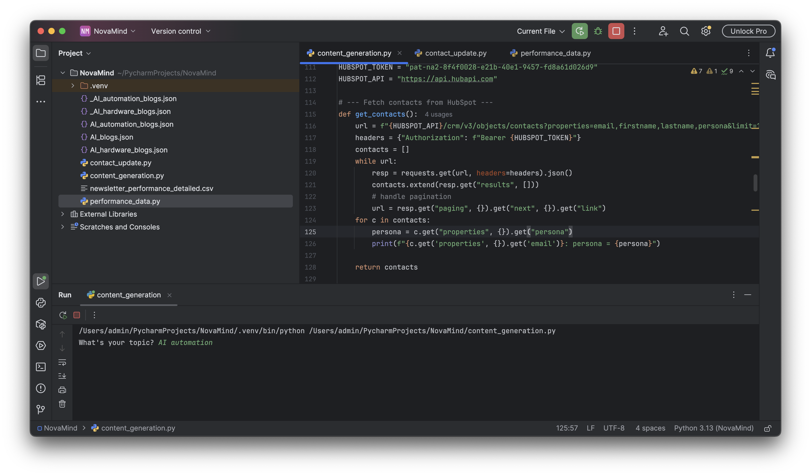
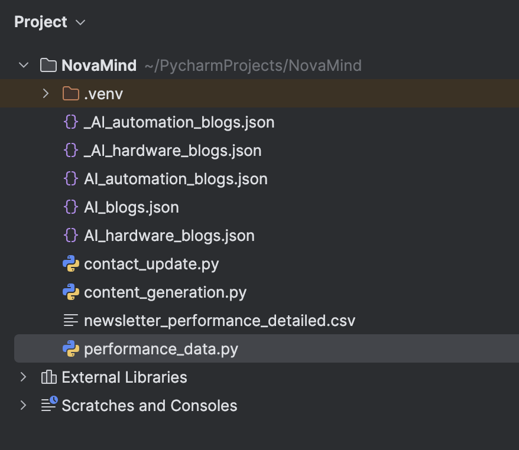
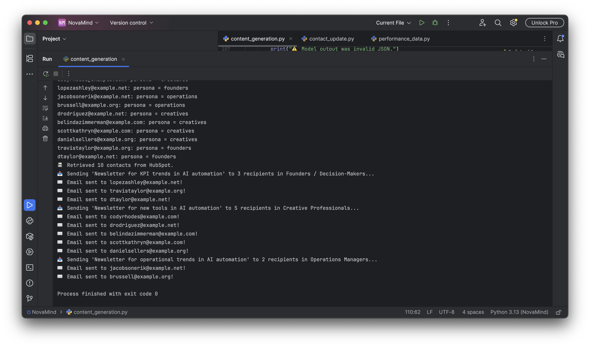
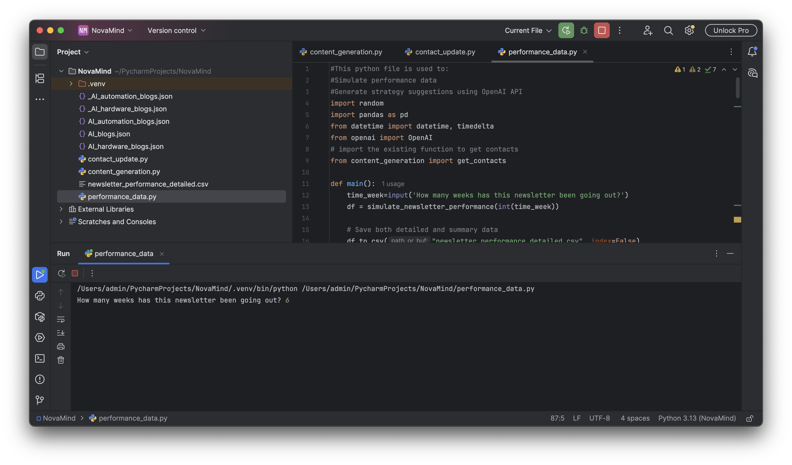
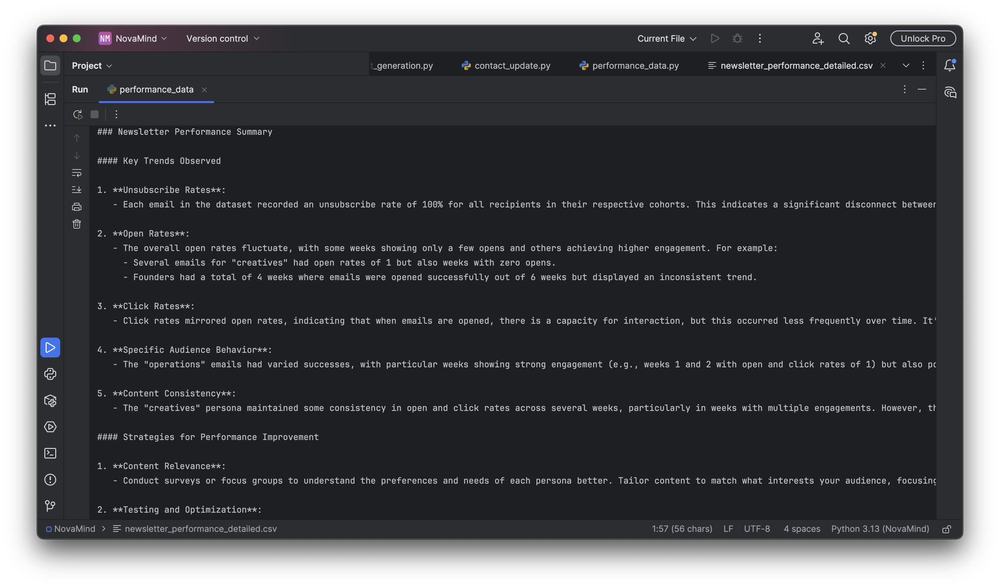

# AI-Powered Marketing Content Pipeline 📬

## Table of Contents
- [Introduction](#introduction)  
- [Objective](#objective)  
- [Scenario](#scenario)  
- [Features](#features)  
- [Architecture & Flow](#architecture--flow)  
- [Installation](#installation)  
- [Usage](#usage)  
- [Project Structure](#project-structure)  
- [Assumptions & Notes](#assumptions--notes)  
- [API / CRM Integration Details](#api--crm-integration-details)  
- [Performance Logging & Analysis](#performance-logging--analysis)  
- [Future Improvements](#future-improvements)  
- [License](#license)  
- [Author](#author)  

---

## Introduction  
This repository contains a lightweight, automated marketing pipeline built for the fictional startup *NovaMind*. It uses AI and CRM integrations to generate blog + newsletter content, distribute it to segmented audiences, and log/analyze results for continuous improvement.

---

## Objective  
- Build a process that:  
  - Ideates and **generates content** (blog draft + three newsletters by persona)  
  - **Distributes** content through a CRM/newsletter workflow  
  - **Collects and analyzes** engagement data to inform optimization  
- End-goal: A mostly hands-free AI pipeline for producing, distributing, and improving marketing content.

---

## Scenario  
You’re the Content & Growth Analyst at NovaMind (an early-stage AI startup for creative agencies). They publish a weekly blog post on automation trends, then send tailored newsletters to three audience types:  
- Founders / Decision-Makers (focus: ROI, growth, efficiency)  
- Creative Professionals (focus: inspiration, time-saving tools)  
- Operations Managers (focus: workflows, integrations, reliability)  
Your task: build an automated system from blog idea → newsletter distribution → performance reporting.

---

## Features  
- AI-Driven content generation (blog + segmented newsletters)  
- CRM (HubSpot) integration → contact creation/segmentation, campaign logging  
- Newsletter distribution via email (Gmail SMTP used here as example)  
- Performance simulation & AI-powered summary of results  
- Structured output (JSON/CSV) supporting future automation & dashboards  

---

## Architecture & Flow  

---

## Installation  
1. Get a free OpenAI API Key
👉 https://platform.openai.com/api-keys

   Get a free gmail account

   Get a HubSpot account

3. Clone the repo
   ```sh
   git clone https://github.com/your_username/ai-marketing-pipeline.git
   cd ai-marketing-pipeline

4. Install Python packages
   - For content_generation:
   ```sh
   pip install uuid
   pip install pandas
   pip install openai
   pip install request
   pip install datetime
   pip install yagmail
   ```
   - For contact_update:
   ```sh
   pip install faker
   ```
   - For performance_data:
   ```sh
   pip install pandas
   pip install openai
   pip install datetime
   
   ```
5. Implement your personal openai API, HubSpot Token, and Gmail account
   ```sh
   # Replace this with your actual key — or use an environment variable
   # In both content_generation and contact_update files

    api_key="sk-proj-yAjWJEgqDRZgCpYGSGNPU6eWmR7fm30UOsYdS_DChfygqsdN8QlriYoEMQ43x39MOI-  2L5Rql5T3BlbkFJUj4Cq_6rFZQYCoICZmPRYomnIW29EYcZzVWfILMDb_v5yGmTaJeciBrubN9MpaBWqnvpzoA2MA"

   HUBSPOT_TOKEN = "pat-na2-8f4f0028-e21b-40e1-9457-fd8a61d026d9"
   HUBSPOT_API = "https://api.hubapi.com"
   ```
   
   ```sh
   # Replace this with your personal Gmail account
   # In content_generation file

    GMAIL_USER = "jinjiaji20040228@gmail.com"
    GMAIL_APP_PASSWORD = "qgfgxfpcflzucxfr"
   ```
  
6. Change settings in HubSpot
7. Change git remote url to avoid accidental pushes to base project
   ```sh
   git remote set-url origin github_username/repo_name
   git remote -v # confirm the changes
   ```
## Usage

Use this space to show useful examples of how a project can be used. Additional screenshots, code examples and demos work well in this space. You may also link to more resources.

I will show one of the examples running through my openai API and Gmail account.
Since I'm using free-trial HubSpot, I send emails from gmail automatically. Within upgraded HubSpot account you can automatically send emails from Hubspot.

### Step 1: Run the contact_update file

To generate 10 mock subscribers with different personas (targeted roles we are sending different contents to).

After running successfully, the mock contacts will be created and logged to the HubSpot contacts.

### Step 2: Run the content_generation file

1. Input the topic you want to create newsletter contents about (e.g. AI automation):
   
2. If the contents are generated successfully, you will see output like this:
   ("✅ Blogs saved to _AI_automation_blogs.json")
3. The personalized newsletters generated will be stored into json file, and you should be able to see a json file called "AI_automation_blogs.json" in your python project file.
   
4. Then the newsletters will be sent to different subscribers based on their titles (creatives, founders, operators), and you will see output like this:
   
   
5. Since the contacts are fake, even though the emails are sent successfully, you will see notifications like this from your gmail account:
   
   

### Step 3: Run the performance_data file

This python file works as the performance analysis automation.

You will be asked to input how many weeks of performance you want to track:


Then you will see a csv file called "newsletter_performance_detailed.csv" generated in your project file. This file stores contact email, contact persona, number of week, send date, whether the contact opened, whether the contact clicked, and whether the contact unsubscribed our newsletters.

You will also see output like this (AI generated analysis on the performance data):



